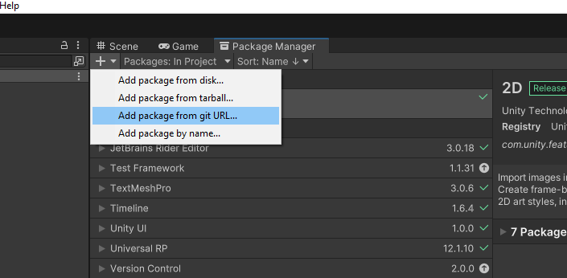
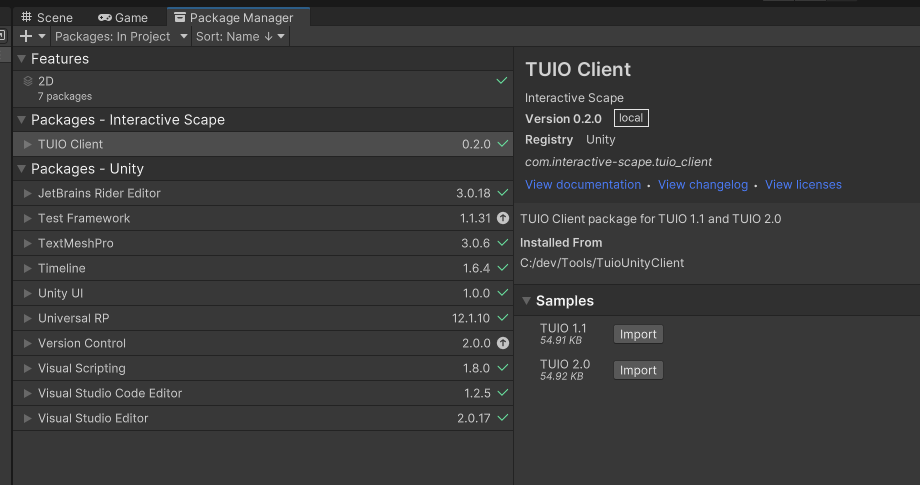
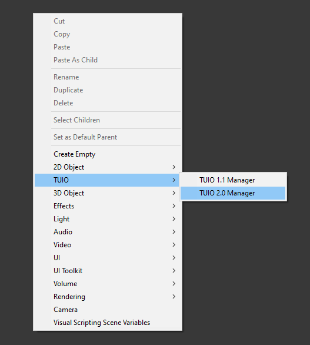
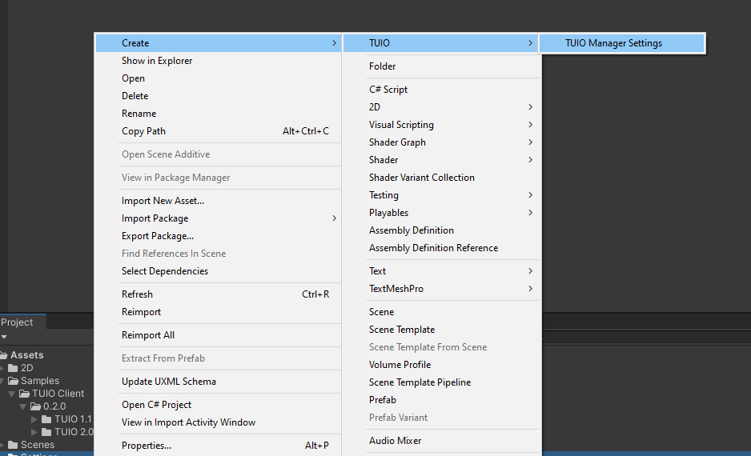
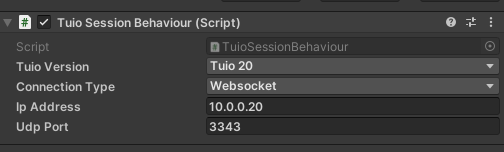
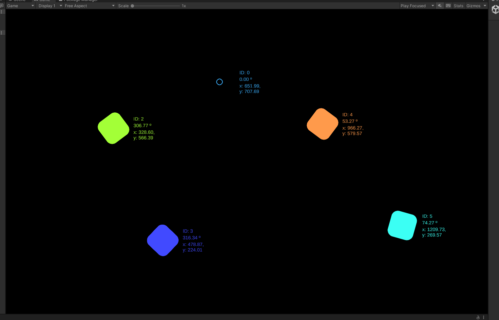

# TUIO Client for Unity
<!-- ALL-CONTRIBUTORS-BADGE:START - Do not remove or modify this section -->
[](#contributors-)
<!-- ALL-CONTRIBUTORS-BADGE:END -->
This package provides the functionality to use TUIO 1.1 or 2.0 in you Unity projects. It is based on [TuioNet](https://github.com/InteractiveScapeGmbH/TuioNet), a .Net implementation of the TUIO 1.1 and 2.0 specification by Martin Kaltenbrunner.

## Overview

A TUIO Client package to enable the easy creation of apps and games that interface with TUIO capable hardware and software for tangible input.

## Package contents

The Editor and Runtime folders contain key scripts for the Unity editor and runtime respectively. The Samples~ folder contains a simple reference implementation for TUIO 1.1 or TUIO 2.0 that visualizes the cursors and objects as coloured squares.

## Installation instructions

Open the Package Manager window and click the plus icon followed by "Add package from git URL...". Enter https://github.com/InteractiveScapeGmbH/TuioUnityClient.git and click "Add".</br>
Alternatively download the code from github, unzip it and choose the "Add package from disk.." option. Select the ```package.json``` file from the package directory.



After the import process is finished the package should appear in the Package Manager and you can import the sample projects.



## Requirements

You will require a TUIO source connected to your device.

This package is built to run from Unity 2020.3 upwards.

**Important:** By default the windows firewall blocks network communication of the Unity Editor. In order to receive UDP messages from other devices in your local network you need to allow it in the windows firewall settings as shown below:


## Dependencies
- TextMesh Pro for displaying debugging information like id, position or angle.

## Limitations

TUIO 1.1 support is currently limited to 2Dobj, 2Dcur and 2Dblb messages.</br>
**Important:** 25Dobj, 25Dcur, 25Dblb, 3Dobj, 3Dcur, 3Dblb and custom messages are all ignored.

TUIO 2.0 support is currently limited to FRM, ALV, TOK, PTR, BND and SYM messages.</br> 
**Important:** T3D, P3D, B3D, CHG, OCG, ICG, SKG, S3D, SVG, ARG, RAW, CTL, DAT, SIG, ALA, COA, LIA, LLA, LTA and custom messages are all ignored.

This package has not been tested outside of Windows, however should be compatible across all platforms.

## Workflows

- Create a TUIO 1.1 Manager or TUIO 2.0 Manager in your scene using GameObject > TUIO in the main Unity window or Right Click > TUIO in the Hierarchy.


- Create a TUIO Manager Settings object in your Assets folder using Right Click > TUIO in the Project window. Reference the created TUIO Manager Settings asset from the TUIO 1.1 Manager or TUIO 2.0 Manager in the Hierarchy.


Set the desired TUIO Manager Settings (see Reference).



Create scripts that implement the Tuio11Listener or Tuio20Listener interface and subscribe them to the manager using ```Tuio11Manager.Instance.AddTuio11Listener(this)``` or ```Tuio20Manager.Instance.AddTuio20Listener(this)```. Use the
appropriate callbacks to implement your own TUIO application. Within the sample projects examples are given with the ```Tuio11Visualizer.cs``` and ```Tuio20Visualizer.cs``` which spawn simple Cursor/Pointer or Objects/Tokens. 

GameObjects which should appear as Cursors/Pointers and Objects/Tokens need an appropriate script attached to them the following are included in this package:
- ```Tuio11CursorBehaviour.cs```
- ```Tuio11ObjectBehaviour.cs```
- ```Tuio20PointerBehaviour.cs```
- ```Tuio20TokenBehaviour.cs```


## Reference

| **Field** | **Format** | **Description** |
|--|--|--|
|Tuio Connection Type | Websocket / UDP | The connection type to use
| Udp Port | 0 - 9999 | The local port to receive UDP messages on |
| Websocket Address | IPv4 address   | The remote address to connect to websocket server
| Websocket Port | 0 - 9999 | The remote port to connect to the websocket server |


## Samples
Samples can be imported via the Package Manager. Right now there are two basic sample scenes for TUIO 1.1 and TUIO 2.0


## Contributors ✨

Thanks goes to these wonderful people ([emoji key](https://allcontributors.org/docs/en/emoji-key)):

<!-- ALL-CONTRIBUTORS-LIST:START - Do not remove or modify this section -->
<!-- prettier-ignore-start -->
<!-- markdownlint-disable -->
<table>
  <tbody>
    <tr>
      <td align="center" valign="top" width="14.28%"><a href="https://www.interactive-scape.com/"><br /><sub><b>Erich Querner</b></sub></a><br /><a href="https://github.com/InteractiveScapeGmbH/TuioUnityClient/commits?author=eqbic" title="Code">💻</a></td>
      <td align="center" valign="top" width="14.28%"><a href="https://github.com/gilescoope"><br /><sub><b>Giles Coope</b></sub></a><br /><a href="https://github.com/InteractiveScapeGmbH/TuioUnityClient/commits?author=gilescoope" title="Code">💻</a></td>
    </tr>
  </tbody>
</table>

<!-- markdownlint-restore -->
<!-- prettier-ignore-end -->

<!-- ALL-CONTRIBUTORS-LIST:END -->

This project follows the [all-contributors](https://github.com/all-contributors/all-contributors) specification. Contributions of any kind welcome!