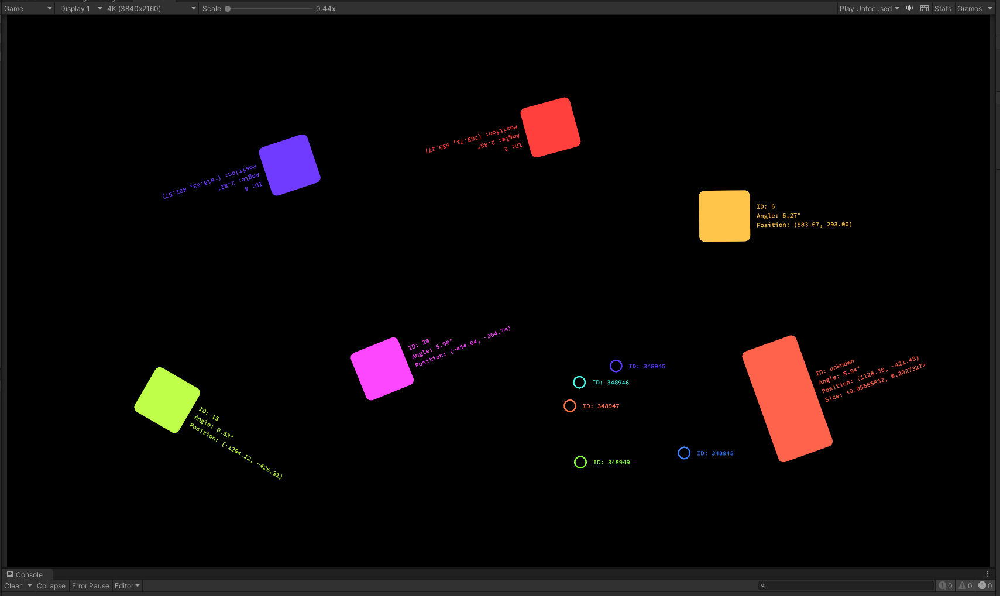

# TUIO Client for Unity
<!-- ALL-CONTRIBUTORS-BADGE:START - Do not remove or modify this section -->
[](#contributors-)
<!-- ALL-CONTRIBUTORS-BADGE:END -->
This package provides the functionality to use TUIO 1.1 or 2.0 in you Unity projects. It is based on [TuioNet](https://github.com/InteractiveScapeGmbH/TuioNet), a .Net implementation of the TUIO 1.1 and 2.0 specification by Martin Kaltenbrunner.

## IMPORTANT
**Version 2.0 introduces breaking changes. Take care when hitting the update button in the package manager!**

## Overview

A TUIO Client package to enable the easy creation of apps and games that interface with TUIO capable hardware and software for tangible input.

## Package contents

The Editor and Runtime folders contain key scripts for the Unity editor and runtime respectively. The Samples~ folder contains a simple reference implementation for TUIO 1.1 or TUIO 2.0 that visualizes the cursors and objects as coloured squares.

## Installation instructions

Open the Package Manager window and click the plus icon followed by "Add package from git URL...". Enter https://github.com/InteractiveScapeGmbH/TuioUnityClient.git and click "Add".</br>
Alternatively download the code from github, unzip it and choose the "Add package from disk.." option. Select the ```package.json``` file from the package directory.


After the import process is finished the package should appear in the Package Manager and you can import the sample projects.


## Requirements

You will require a TUIO source connected to your device.

This package is built to run from Unity 2021.3 upwards.

**Important:** By default the windows firewall blocks network communication of the Unity Editor. In order to receive UDP messages from other devices in your local network you need to allow it in the windows firewall settings as shown below:


## Dependencies
- TextMesh Pro for displaying debugging information like id, position or angle.

## Limitations

TUIO 1.1 support is currently limited to 2Dobj, 2Dcur and 2Dblb messages.</br>
**Important:** 25Dobj, 25Dcur, 25Dblb, 3Dobj, 3Dcur, 3Dblb and custom messages are all ignored.

TUIO 2.0 support is currently limited to FRM, ALV, TOK, PTR, BND and SYM messages.</br> 
**Important:** T3D, P3D, B3D, CHG, OCG, ICG, SKG, S3D, SVG, ARG, RAW, CTL, DAT, SIG, ALA, COA, LIA, LLA, LTA and custom messages are all ignored.

This package has not been tested outside of Windows, however should be compatible across all platforms.

## Workflows

- Create a TUIO 1.1 Session or TUIO 2.0 Session in your scene using GameObject > TUIO in the main Unity window or Right Click > TUIO in the Hierarchy.


Set the desired TUIO Session Settings (see Reference).


**Default Websocket ports**
- Tuio 1.1: `3333`
- Tuio 2.0: `3343`

### Simple Setup
- Add a TUIO 1.1 or TUIO 2.0 Visualizer from the `Prefabs` folder of the package to your scene
- Set the reference to the `Tuio Session` and make sure all references to Tuio Prefabs are set (you can find them in the `Prefabs` folder of the packge too.)


### Advanced Setup
The TUIO Visualizer Prefabs are just for testing purpose to check if everything works as expected. But they are simple examples how to implement your own custom solution. The most important component is the `TuioDispatcher`. There is one for Tuio 1.1 (`Tuio11Dispatcher`) and Tuio 2.0 (`Tuio20Dispatcher`). They provide all events you need to. You can access the dispatcher through the `TuioSession` object.

In general there are four types of events we care about. `Add`, `Update`, `Remove` and `Refresh`. 
- `Add`/`Remove`: are called once when a touch or an object gets placed or removed from the table
- `Update`: is called everytime when a property of a touch or an object was changed this frame (e.g. it was moved or rotated)
- `Refresh`: is called every frame. This can be helpful if you want to handle all updates conained in one TUIO frame together

There are some little differences between Tuio 1.1 and Tuio 2.0 for `Add`, `Remove` and `Update`.

#### TUIO 1.1
- there are `Add`, `Remove` and `Update` events for each type of tuio objects (`Touch`, `Object`, `Blob`)
```csharp
public event Action<Tuio11Cursor> OnCursorAdd;
public event Action<Tuio11Cursor> OnCursorUpdate;
public event Action<Tuio11Cursor> OnCursorRemove;

public event Action<Tuio11Object> OnObjectAdd;
public event Action<Tuio11Object> OnObjectUpdate;
public event Action<Tuio11Object> OnObjectRemove;

public event Action<Tuio11Blob> OnBlobAdd;
public event Action<Tuio11Blob> OnBlobUpdate;
public event Action<Tuio11Blob> OnBlobRemove;
```

#### TUIO 2.0
- for tuio 2.0 things are handled a little bit differently. There is only one `Add`, `Remove` and `Update` event. 
```csharp
public event Action<Tuio20Object> OnObjectAdd;
public event Action<Tuio20Object> OnObjectUpdate;
public event Action<Tuio20Object> OnObjectRemove;
```
The `Tuio20Object` can hold different Tuio 2.0 types simultaneously and has methods to check which type it contains:

**Tuio20Object.cs**
```csharp
 public bool ContainsTuioToken() => this.Token != null;

public bool ContainsTuioPointer() => this.Pointer != null;

public bool ContainsTuioBounds() => this.Bounds != null;

public bool ContainsTuioSymbol() => this.Symbol != null;

public bool ContainsNewTuioToken()
{
  Tuio20Token token = this.Token;
  return token != null && token.State == TuioState.Added;
}

public bool ContainsNewTuioPointer()
{
  Tuio20Pointer pointer = this.Pointer;
  return pointer != null && pointer.State == TuioState.Added;
}

public bool ContainsNewTuioBounds()
{
  Tuio20Bounds bounds = this.Bounds;
  return bounds != null && bounds.State == TuioState.Added;
}

public bool ContainsNewTuioSymbol()
{
  Tuio20Symbol symbol = this.Symbol;
  return symbol != null && symbol.State == TuioState.Added;
}
```

You can then access the object you want by public properties of the `Tuio20Object`

```csharp
public Tuio20Token Token { get; private set; }

public Tuio20Pointer Pointer { get; private set; }

public Tuio20Bounds Bounds { get; private set; }

public Tuio20Symbol Symbol { get; private set; }
```

## Reference

| **Field** | **Format** | **Description** |
|--|--|--|
|Tuio Version|Tuio 1.1/ Tuio 2.0| Version of the Tuio specification you want to use
|Tuio Connection Type | Websocket / UDP | The connection type to use
| Udp Port | 0 - 9999 | The local port to receive UDP messages on |
| Websocket Address | IPv4 address   | The remote address to connect to websocket server


## Samples
Samples can be imported via the Package Manager. Right now there are two basic sample scenes for TUIO 1.1 and TUIO 2.0


## Contributors ✨

Thanks goes to these wonderful people ([emoji key](https://allcontributors.org/docs/en/emoji-key)):

<!-- ALL-CONTRIBUTORS-LIST:START - Do not remove or modify this section -->
<!-- prettier-ignore-start -->
<!-- markdownlint-disable -->
<table>
  <tbody>
    <tr>
      <td align="center" valign="top" width="14.28%"><a href="https://www.interactive-scape.com/"><br /><sub><b>Erich Querner</b></sub></a><br /><a href="https://github.com/InteractiveScapeGmbH/TuioUnityClient/commits?author=eqbic" title="Code">💻</a></td>
      <td align="center" valign="top" width="14.28%"><a href="https://github.com/gilescoope"><br /><sub><b>Giles Coope</b></sub></a><br /><a href="https://github.com/InteractiveScapeGmbH/TuioUnityClient/commits?author=gilescoope" title="Code">💻</a></td>
    </tr>
  </tbody>
</table>

<!-- markdownlint-restore -->
<!-- prettier-ignore-end -->

<!-- ALL-CONTRIBUTORS-LIST:END -->

This project follows the [all-contributors](https://github.com/all-contributors/all-contributors) specification. Contributions of any kind welcome!